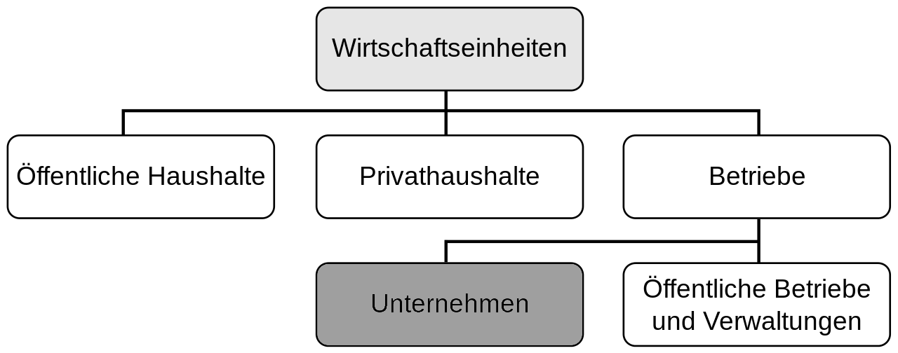

Allgemeine Betriebswirtschaftslehre
===================================

<!-- START doctoc generated TOC please keep comment here to allow auto update -->
<!-- DON'T EDIT THIS SECTION, INSTEAD RE-RUN doctoc TO UPDATE -->
**Inhaltsverzeichnis**

- [Unternehmensführung](#unternehmensf%C3%BChrung)
- [Produktionsfaktoren, betriebliche Funktionsbereiche](#produktionsfaktoren-betriebliche-funktionsbereiche)
  - [Begriffe](#begriffe)
  - [Merkmale eines Unternehmens](#merkmale-eines-unternehmens)
  - [Wirtschaftliches System](#wirtschaftliches-system)
  - [Rechtsformen](#rechtsformen)
  - [Marktbeurteilung](#marktbeurteilung)
  - [Einflussfaktoren](#einflussfaktoren)
  - [Unternehmensführung](#unternehmensf%C3%BChrung-1)
- [Personalplanung, -Bedarf, -Deckung, -Entwicklung](#personalplanung--bedarf--deckung--entwicklung)
- [Externes Rechnungswesen](#externes-rechnungswesen)
- [Internes Rechnungswesen](#internes-rechnungswesen)
- [Investition und Finanzierung](#investition-und-finanzierung)
- [Protektionswirtschaft](#protektionswirtschaft)
- [Marketing](#marketing)

<!-- END doctoc generated TOC please keep comment here to allow auto update -->

<!--newpage-->

# Unternehmensführung

# Produktionsfaktoren, betriebliche Funktionsbereiche

## Begriffe

- **Betrieb:** Ort der Leistungserbringung
- **Unternehmen:** ganzheitliche, rechtliche, finanzielle und wirtschaftliche Einheit des Betriebs

## Merkmale eines Unternehmens

- komplexes System aus Ressourcen (HR, MR, FR)
	- HR = Mitarbeiter mit Fähigkeiten, Fertigkeiten, Wissen und Erfahrungen
	- MR = Maschinen, Gebäude, Material, Lizenzen
	- FR = Finanzielle Mittel -> Eigen- und Fremdkapital
- weitgehend autonome Festlegung von Zielen -> **Autonomieprinzip**
- MA bilden **soziales System** (Gruppen, Teams, Abteilungen, ...) -> ausgerichtet auf Leistungserbringung (erwerbswirtschaftliches Prinzip), Austausch mit Unternehmensumwelt (Markt)

## Wirtschaftliches System

- Markt/Ökonomie: Input-/Output-Beziehungen = Kaufen + Verkaufen
- Umwelt: Schonung der Ressourcen
- Soziale Beziehungen: Gesellschaftliche Rahmenbedingungen

> Drei Säulen der Nachhaltigkeit

<!--height=200px-->

## Rechtsformen

**Personengesellschaften**

- meist Eigentümer-geführte Unternehmen
- Einzelkaufmann, GbR, OHG

**Kapitalgesellschaften**

- Eigentum und Geschäftsführung sind getrennt (Aktionäre <-> Vorstand)
- GmbH, AG

## Marktbeurteilung

- **Polypol:** viele Anbieter, viele Nachfrager
- **Oligopol:** wenige Anbieter bzw. wenige ein Nachfrager
- **Monopol:** ein Anbieter bzw. ein Nachfrager

## Einflussfaktoren

- Gesellschaftsordnung: Kapitalismus
- Politische Ordnung: Föderalismus
- Wirtschaftsordnung: soziale Marktwirtschaft
- Rechtsordnung: Verfassungs-, Straf-, Privat- und Öffentliches Recht

> Die Einflussfaktoren wirken gemeinsam auf die Unternehmenspolitik ein

## Unternehmensführung

- Kapitalismus -> langfristige Gewinnmaximierung (**erwerbswirtschaftliches Prinzip**)
- einheitliche Führung notwendig (Prinzip des Privateigentums)
- Hauptaufgabe: Definition und Überwachung (Controlling) der betrieblichen Zielsetzungen (Gewinn) = **Autonomieprinzip**
- Führen als Entscheidungskonzept der Organisation

# Personalplanung, -Bedarf, -Deckung, -Entwicklung

# Externes Rechnungswesen

# Internes Rechnungswesen

# Investition und Finanzierung

# Protektionswirtschaft

# Marketing
