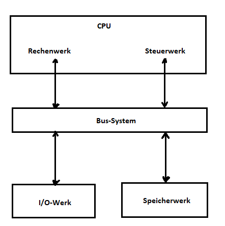
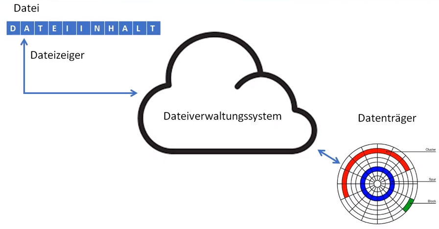
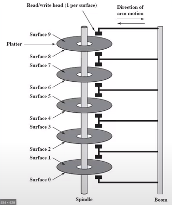
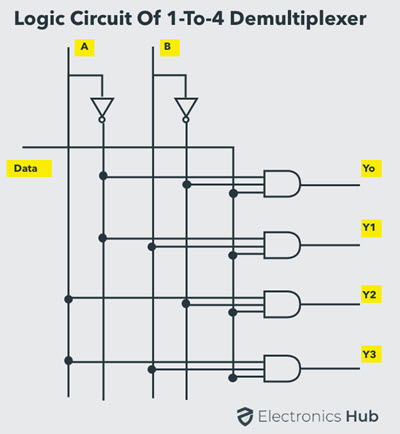
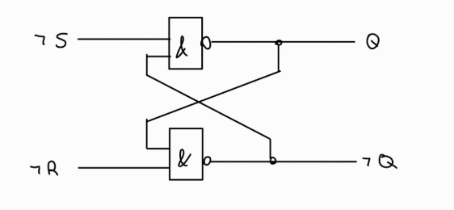
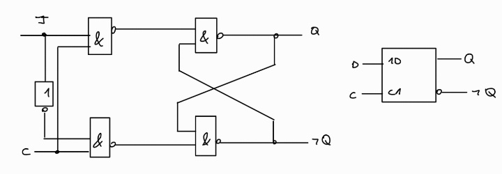
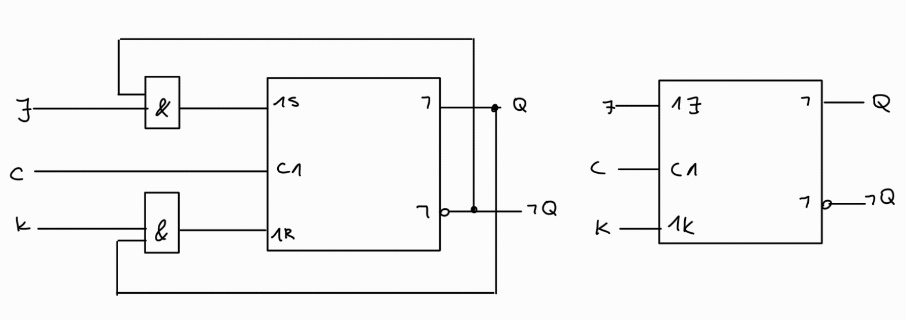
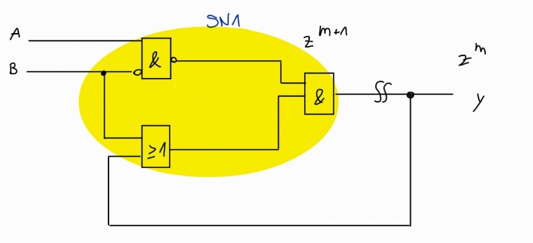
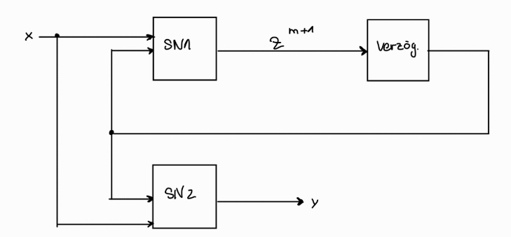
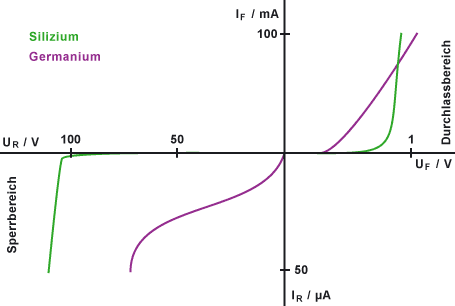

MPP1 - Themenkatalog
====================

> **Hinweis**
>
> Dieser Themenkatalog basiert auf den Katalog von PI19 und wurde von PI20 *vor* der MPP angepasst.
> Inhalte kommen größtenteils von Mitstudenten.
> Diese Zusammenfassung kann keine eigenen Aufzeichnungen ersetzen und dient ausschließlich als Leitpfaden.
> Sämtliche Überschriften mit ! wurden nicht behandelt.

<!-- START doctoc generated TOC please keep comment here to allow auto update -->
<!-- DON'T EDIT THIS SECTION, INSTEAD RE-RUN doctoc TO UPDATE -->
**Inhaltsverzeichnis**

- [MPP1 - Themenkatalog](#mpp1---themenkatalog)
- [Präambel](#präambel)
  - [Most Important Topics](#most-important-topics)
- [Grundlagen der Informationsverarbeitung](#grundlagen-der-informationsverarbeitung)
  - [Grundbegriffe zum eventuellen Wiederholen](#grundbegriffe-zum-eventuellen-wiederholen)
  - [Von-Neumann-Architektur](#von-neumann-architektur)
  - [Harvard-Architektur](#harvard-architektur)
  - [Befehlsverarbeitung](#befehlsverarbeitung)
  - [Einordnung von Programmiersprachen / Programmierparadigmen](#einordnung-von-programmiersprachen--programmierparadigmen)
    - [Problemorientierte Programmiersprachen](#problemorientierte-programmiersprachen)
    - [Maschinenorientierte Programmiersprachen](#maschinenorientierte-programmiersprachen)
  - [`Call by Value` vs. `Call by Reference`](#call-by-value-vs-call-by-reference)
  - [Unterschied Java, JavaScript, C#, C++](#unterschied-java-javascript-c-c)
  - [Statisches vs. dynamisches Linking](#statisches-vs-dynamisches-linking)
  - [Gleitpunktverfahren](#gleitpunktverfahren)
  - [Umrechnen von Zahlensystemen](#umrechnen-von-zahlensystemen)
    - [Dezimal zu X](#dezimal-zu-x)
    - [X zu Dezimal](#x-zu-dezimal)
  - [Datenträgerverwaltung](#datenträgerverwaltung)
    - [Datenverwaltung](#datenverwaltung)
    - [Organisation von Dateien](#organisation-von-dateien)
- [Digitaltechnik](#digitaltechnik)
  - [Inhalte](#inhalte)
  - [Eigenschaften von Codes](#eigenschaften-von-codes)
    - [BCD-Code](#bcd-code)
    - [Gray-Code](#gray-code)
    - [!Aiken-Code!](#aiken-code)
  - [!Fehlererkennbare Codes!](#fehlererkennbare-codes)
  - [!Fehlerkorrigierbare Codes!](#fehlerkorrigierbare-codes)
  - [AD-Wandler](#ad-wandler)
  - [Volladdierer](#volladdierer)
  - [Konjunktive/Disjunktive-Normalform](#konjunktivedisjunktive-normalform)
  - [KV-Diagramme](#kv-diagramme)
  - [Vereinfachung Boolescher Schaltfunktionen](#vereinfachung-boolescher-schaltfunktionen)
  - [Arten von Kippgliedern](#arten-von-kippgliedern)
  - [Schaltsymbole](#schaltsymbole)
  - [Multiplexer/Demultiplexer](#multiplexerdemultiplexer)
  - [FlipFlop](#flipflop)
    - [RS-FlipFlop](#rs-flipflop)
      - [Wahrheitstabelle der Gatter](#wahrheitstabelle-der-gatter)
      - [Wahrheitstabelle FF](#wahrheitstabelle-ff)
    - [D-FF](#d-ff)
    - [JK-FF](#jk-ff)
    - [T-FF](#t-ff)
  - [Schaltnetz/Schaltwerk](#schaltnetzschaltwerk)
    - [Hazards](#hazards)
    - [Moore](#moore)
    - [Mealy](#mealy)
- [Elektrotechnik](#elektrotechnik)
  - [Grundlegende Inhalte](#grundlegende-inhalte)
  - [Grundlegende elektrische Bauteile](#grundlegende-elektrische-bauteile)
    - [Kondensator](#kondensator)
    - [Ohmscher Widerstand](#ohmscher-widerstand)
    - [Diode](#diode)
    - [Transistor](#transistor)
      - [CMOS](#cmos)
      - [Spule](#spule)
      - [Schaltungstypen](#schaltungstypen)
  - [Flüchtiger RAM](#flüchtiger-ram)
  - [Signalübertragung Kabel](#signalübertragung-kabel)
  - [weitere Themen](#weitere-themen)
- [Algorithmen und Datenstrukturen](#algorithmen-und-datenstrukturen)
  - [Eigenschaften von Algorithmen](#eigenschaften-von-algorithmen)
  - [Sortieralgorithmen](#sortieralgorithmen)
    - [Selection-Sort](#selection-sort)
    - [Bubble-Sort](#bubble-sort)
    - [Insertion-Sort](#insertion-sort)
    - [Quick-Sort](#quick-sort)
    - [Merge-Sort](#merge-sort)
  - [Binärbaum](#binärbaum)
  - [Einfach verkettete Liste](#einfach-verkettete-liste)
  - [Verschlüsselung](#verschlüsselung)
    - [Schutzziele](#schutzziele)
    - [symmetrisch vs. asymmetrisch](#symmetrisch-vs-asymmetrisch)
  - [Hashing](#hashing)
  - [Digitale Signatur](#digitale-signatur)
  - [Stack und Queue](#stack-und-queue)
  - [Graphen](#graphen)
  - [Struktogramm](#struktogramm)
- [Automaten und Sprachen](#automaten-und-sprachen)
  - [Reguläre Ausdrücke](#reguläre-ausdrücke)
  - [Grammatiken](#grammatiken)
  - [Turing-Maschine](#turing-maschine)
  - [Registermaschinen](#registermaschinen)
  - [Automatenkonstruktion](#automatenkonstruktion)
- [Betriebssysteme](#betriebssysteme)
  - [Definition Betriebssystem](#definition-betriebssystem)
  - [Aufgaben eines Betriebssystems](#aufgaben-eines-betriebssystems)
  - [Klassifizierung von Betriebssystemen](#klassifizierung-von-betriebssystemen)
  - [Betriebsmittel](#betriebsmittel)
  - [Thread/Prozess/Task](#threadprozesstask)
  - [Parallelität und Nebenläufigkeit](#parallelität-und-nebenläufigkeit)
  - [Dateisysteme](#dateisysteme)
  - [Virtueller Speicher](#virtueller-speicher)
  - [Cache](#cache)
  - [Speicherzuweisungsstrategien](#speicherzuweisungsstrategien)
  - [Seitenersetzungsstrategien](#seitenersetzungsstrategien)
  - [Scheduling-Strategien für Prozesse](#scheduling-strategien-für-prozesse)
  - [Adressierungsarten](#adressierungsarten)
  - [Serielle vs. Parallele Datenübertragung](#serielle-vs-parallele-datenübertragung)
  - [Interrupts](#interrupts)
  - [Semaphore](#semaphore)
  - [Spooling](#spooling)
- [Betriebssystemverwaltung](#betriebssystemverwaltung)
  - [RAID](#raid)
  - [Pipes](#pipes)
  - [Datensicherung](#datensicherung)
- [Rechnernetze](#rechnernetze)
  - [ISO/OSI-Referenzmodell und TCP/IP](#isoosi-referenzmodell-und-tcpip)
  - [Netzwerktopologien](#netzwerktopologien)
  - [IP und Routing](#ip-und-routing)
  - [IPv4 vs IPv6](#ipv4-vs-ipv6)
  - [UDP vs TCP](#udp-vs-tcp)
  - [TCP-Handshake](#tcp-handshake)
    - [TCP Fast-Open](#tcp-fast-open)
  - [TLS](#tls)
  - [DNS](#dns)
  - [URL-Aufruf](#url-aufruf)
  - [DHCP](#dhcp)
  - [SDSL / ADSL](#sdsl--adsl)
- [Datenbanken](#datenbanken)
  - [Datenbankentwurf](#datenbankentwurf)
  - [ANSI-SPARC Drei-Ebenen-Konzept](#ansi-sparc-drei-ebenen-konzept)
  - [Datenmodelle](#datenmodelle)
  - [Operationen im Relationalen Modell](#operationen-im-relationalen-modell)
  - [ACID (Transkationseigenschaften)](#acid-transkationseigenschaften)
  - [Sperrkonzepte](#sperrkonzepte)
  - [Constraints](#constraints)
  - [Speicherpyramide](#speicherpyramide)
- [Systemanalyse](#systemanalyse)
  - [Softwareengineering](#softwareengineering)
  - [Lasten- und Pflichtenheft](#lasten--und-pflichtenheft)
  - [Phasenmodelle](#phasenmodelle)
    - [Wasserfallmodell (einfaches Phasenmodell)](#wasserfallmodell-einfaches-phasenmodell)
    - [Iteriertes Phasenmodell](#iteriertes-phasenmodell)
    - [Spiralenmodell](#spiralenmodell)
    - [V-Modell](#v-modell)
- [Systementwurf](#systementwurf)
  - [OOP-Paradigmen](#oop-paradigmen)
  - [MVC-Architektur](#mvc-architektur)
  - [Compiler vs. Interpreter](#compiler-vs-interpreter)
  - [XML](#xml)
- [Hardwarenahe Programmierung](#hardwarenahe-programmierung)
  - [RISC vs. CISC](#risc-vs-cisc)
  - [Pipelining](#pipelining)
- [IT-Trends](#it-trends)
  - [Cloud Computing](#cloud-computing)
  - [Machine-Learning und Künstliche Intelligenz](#machine-learning-und-künstliche-intelligenz)
  - [Internet of Things (IoT)](#internet-of-things-iot)

<!-- END doctoc generated TOC please keep comment here to allow auto update -->

<!--pagebreak-->

# Präambel

## Most Important Topics

- ISO/OSI
- OOP-Paradigmen
- TCP/IP, Handshake, IPv4 vs IPv6, Routing, IP und MAC, UDP-TCP, HTTP vs HTTPS
- Rechnerarchitektur
- Unterschiede Programmiersprachen, Einordnung, Compiler vs Interpreter
- Datenbankentwurf, ER-Modell, SQL, ACID
- 3-Schichten-Architektur
- Struktogramm
- V-Modell, Scrum
- Verschlüsselung (Arten,Verfahren,Hash)
- Definition Betriebssystem, Aufgaben, Scheduling, Parallelisierung
- RAID Level
- Sortieralogrithmen
- Grundlagen Schaltung/Elektrotechnik
  - Vorwiderstand berechnen
  - R=U/I etc.

# Grundlagen der Informationsverarbeitung

> **ToDo:**
>
> - Struktogramm?

## Grundbegriffe zum eventuellen Wiederholen

- EVA-Prinzip
- Single-User/Multi-User Systeme
- [Datenhierarchie](https://www.youtube.com/watch?v=gBq7rww9amw&feature=youtu.be)
- Unix-Dateisystem

## Von-Neumann-Architektur



- binär codierte Daten und Programme im gleichen Speicher
- Ordnung aufeinanderfolgender Befehle entspricht physischen Speicherung (Abweichungen über Sprünge möglich)
- Kommunikation über BUS-Systeme (Daten-, Adress-, Steuer-, ...)
- **Neumann-Flaschenhals:** Bussystem $\rightarrow$ ein Bus (und Speicher) für Programme und Daten

## Harvard-Architektur

- Separation von Befehls- und Datenspeicher
- getrennter Bus für Programme und Daten (aktive und passive Daten)
- $\rightarrow$ Mitigation des von-Neumann-Flaschenhalses
- im Betrieb (während der Programmausführung) ist Programmspeicher read-only

## Befehlsverarbeitung

> *Wie erfolgt die Befehlsabarbeitung in einer CPU?*

```text
       ┌──────────────────┒
       ↓                  │
   Holphase               │
       ↓                  │
  Decodierphase       nächster
       ↓               Befehl
Ausführungsphase          │
       ↓                  │
  ┌─ STOP? ───────────────┘
  ↓
STOP
```

- **Holphase:** Transport des nächsten Befehls aus dem Speicher ins Steuerwerk
- **Decodierphase:** Entschlüsseln und Interpretieren des Befehls
- **Ausführungsphase:** Erzeugung von Steuersignalen zur Ausführung des Befehls (z.B. durch Mikroprogramme)
- Wiederholung der Phasen, bis ein STOP-Befehl erreicht wird

## Einordnung von Programmiersprachen / Programmierparadigmen

| Maschinenorientierte Sprachen                                                 | Problemorientierte Sprachen                                           |
| ----------------------------------------------------------------------------- | --------------------------------------------------------------------- |
| orientieren sich am Befehlssatz der zugrundeliegenden Hardware                | Sprache orientiert sich an den zu lösenden Problemstellungen          |
| Programmierung für einen spezifischen Prozessor (nicht plattformübergreifend) | Bsp.: imperative, funktionale, logische o. deskriptive Programmierung |
| sehr einfache Befehle $\rightarrow$ Komplexe Programmierung                   | auch "höhere Programmiersprachen"                                     |
| Assembler-Programmierung $=$ Vereinfachung durch mnemonische Ersetzungen      | plattformunabhängige Entwicklung durch Verwendung von Compilern       |
| hohe Effizienz                                                                | einfachere Programmierung                                             |

### Problemorientierte Programmiersprachen

- zu sehr großen Teil von der zugrundeliegenden Maschine unabhängig
- definierter Kern: Wesen der Sprachen überall gleich
- eventuell maschinen-/plattformspezifische Erweiterungen
- sog. Quellprogramme werden mit Übersetzungswerkzeugen in Maschinensprache des Rechners übersetzt
- Eigentlicher Programmcode ist Quellprogramm
- "Höhere Programmiersprache"

**Imperative Programmiersprachen**

- Folge von Anweisungen
- Weg der Verarbeitung im Vordergrund
- Bsp.: C, Pascal, Fortan, Cobol, Basic

**Funktionale Programmiersprachen**

- Funktionen die Eingabegrößen in Ausgabegrößen abbilden
- Funktionen bestehen aus Ausdrücken, die sich aus Operationen zusammensetzen
- Bsp.: Lisp

**Deskriptive Programmiersprachen**

- Ergebnis selbst im Vordergrund $\rightarrow$ Sprache beschreibt Eigenschaften des gewünschten Ergebnis
- Programm liefert alle Eingabewerte, die diese Bedingungen erfüllen
- keine Manipulation der Eingabegrößen
- oft Abfragesprachen für Datenbanken $\rightarrow$ Bsp.: SQL

**Prädikative Programmiersprachen**

- Beweis in einem System aus Tatsachen und Regeln im Vordergrund (= Wissensbasis)
- Benutzer formuliert Anfrage an das System, welches versucht, diese mit "richtig" oder "falsch" zu beantworten
- Bsp.: Prolog

**Objektorientierte Programmiersprachen**

- Zusammenfassen der zur Lösung von Teilproblemen notwendigen Daten und Operationen zu Objekten
- Objekte kommunizieren über Signale und Botschaften miteinander
- einige imperative Vertreter sind durch objektorientierte Programmierung erweitert wurden
- Bsp.: C++, Java, Smalltalk

### Maschinenorientierte Programmiersprachen

- Orientierung an der vorliegenden Hardware (Befehlssatz des Zentralprozessors)
- Typische Vertreter: Assemblersprachen

**Befehl**

- bezeichnen einzelne Arbeitsschritte $\rightarrow$ kleinste, nicht weiter zerlegbare Einheit einer Programmiersprache
- bei problemorientierten Sprachen: Anweisung (oft keine einzelnen Schritte, sondern komplexere Abläufe)
- Befehl = Operationsteil + Adressteil

## `Call by Value` vs. `Call by Reference`

- `Call by Value`: Übergabe der Kopie eines Parameters bei Funktionsaufruf (z.B. `int`, `char` in `C`; Kopie existiert nur innerhalb der Funktion)
- `Call by Reference`: Übergabe der Referenz auf einen Parameter bei Funktionsaufruf (z.B. `*` in `C`; Änderungen bleiben nach Verlassen der Funktion erhalten)

## Unterschied Java, JavaScript, C#, C++

| Java                        | JavaScript                  | C#                 | C++                                      |
| --------------------------- | --------------------------- | ------------------ | ---------------------------------------- |
| (optimierter) Interpreter   | Interpreter                 | Compiler           | Compiler                                 |
| plattformunabhängig         | plattformunabhängig         | plattformabhängig  | plattformabhängig                        |
| statically typed            | dynamically typed           | statically typed   | statically typed                         |
| Server-Anwendungen, Android | Web- und Server-Anwendungen | Desktop-Awendungen | Low-Level / High-Performance-Anwendungen |

## Statisches vs. dynamisches Linking

**statisches Binden**

- inkludierter Code wird in-place ersetzt
- größere Binary
- gute Portabilität

**dynamisches Binden**

- Laden einer DLL (Bibliothek) zur Laufzeit
- kleinere Binary, aber ohne DLL/SO nicht lauffähig
- Austausch einer DLL einfach
- "schlechte" Portabilität

## Gleitpunktverfahren

**eine Gleitkommazahl setzt sich zusammen aus:**

- Vorzeichenbit: Vorzeichen der Mantisse
- Mantisse: auf $0.$ formatierte Zahl
  - 25 Stellen (bei 32-Bit Zahl)
- Exponent: Anzahl Stellen, um die das Komma der Mantisse verschoben wurde
  - 6 Stellen (bei 32-Bit Zahl)
- Bias: konstanter Wert, der vom Exponenten abgezogen wird, um negative Exponenten darstellen zu können ($\text{Exponent} - \text{Bias} = \text{tatsächlicher Exponent}$)
  - üblicherweise 32

## Umrechnen von Zahlensystemen

### Dezimal zu X

**Divisionsrestmethode**

- bsp.: 160 zu Basis 7

$$\begin{matrix}
160 / 7 & = 22 &  R 6 \\
22 / 7 & = 3 & R 1 \\
3 / 7 & = 0 & R 3 \\
\end{matrix}
\uparrow\\
\Rightarrow 316_7$$

### X zu Dezimal

- bsp.: $316_7$ zu dezimal

$$
6\cdot 7^0 + 1 \cdot 7^1 + 3 \cdot 7^2 = 160_{10}
$$

## Datenträgerverwaltung




### Datenverwaltung

- Jede Datei erhält eigenen Dateidiskriptor
  - Datensatz der Datei näher Beschreibt (Dateiname, Adresse etc.)
- Organisation der Daten in Dateien (Zusammengefasste Menge an Daten in bestimmter Struktur)
- Wenn Datei Blockgröße des Speichermediums überschreitet, können Daten nicht sequentiell gespeichert werden
  - OS muss entsprechende Byteströme finden
  - Defragmentierung schiebt Daten wieder zusammen

### Organisation von Dateien

- Sequenzielle Dateiorganisation (Heap)
- Indexierte Dateien
- Indexsequentiell
- Multilisten
- Mehrstufige Indexstrukturen

----------------------------------------------------------------------------------------------------------------------

# Digitaltechnik

## Inhalte

- Wie viel Bit benötigt man, um 1 Fehler zu erkennen bzw. zu korrigieren? 1/3 (Hamming 7-4 Code)
- AD Wandler
- Multiplexer, MUX-Bus, Vorteile gegenüber einem normalen Bus
- Normalformen
- Konjunktion, Disjunktion, Möglichkeiten zur Vereinfachung, Boolesche Algebra, KV
- De-morgansches-Gesetz
- XOR Wahrheitstabelle
- RS FlipFlop Definition und Schaltung aufzeichnen

## Eigenschaften von Codes

> *Was ist ein Code?(+Eigenschaften) Wie funktioniert ein BCD-Code, Binärcodes, Gray-Code*

Code = Abbildungsvorschrift zur Darstellung von Zahlen

- **Bewertbarkeit:** jeder Stelle wird eine bestimmte Wertigkeit zugeordnet
- **Gewicht:** Anzahl der mit `1` belegten Stellen
- **Distanz:** Anzahl der Stellen, die sich zwischen benachbarten Codeworten unterscheiden
- **Stetigkeit:** stetig, wenn die Distanz über den gesamten Code hinweg gleich ist
- **Redundanz:** mögliche Kombinationen vs. vom Code genutzte Kombinationen

### BCD-Code

- binär codierte Dezimalziffern
- Redundanzen: bei 4 Bit nur 10 Kombinationen belegt

```text
Ziffer | BCD-Code
   0   |   0000
   1   |   0001
   2   |   0010
   3   |   0011
   4   |   0100
   5   |   0101
   6   |   0110
   7   |   0111
   8   |   1000
   9   |   1001
```

### Gray-Code

- einschrittiger Code (Vermeidung von Abtastfehlern an einer Codescheibe)

```text
Ziffer | Gray-Code
   0   |   0000
   1   |   0001
-------------------> Reflektionslinie 1
   2   |   0011
   3   |   0010
-------------------> Reflektionslinie 2
   4   |   0110
   5   |   0111
   6   |   0101
   7   |   0100
-------------------> Reflektionslinie 3
   8   |   1100
   9   |   1101
  10   |   1111
  11   |   1110
  12   |   1010
  13   |   1011
  14   |   1001
  15   |   1000
```

### !Aiken-Code!

> Nicht bei PI20 behandelt

- Ziffern 5-9 negativsymmetrisch zu 0-4 $\rightarrow$ Neunerkomplementbildung durch Negation

```text
Ziffer | Aiken-Code
   0   |   0000
   1   |   0001
   2   |   0010
   3   |   0011
   4   |   0100
--------------------
   5   |   1011
   6   |   1100
   7   |   1101
   8   |   1110
   9   |   1111
```

## !Fehlererkennbare Codes!

> Wurde bei PI20 nicht behandelt

- Ziel: Erkennen einfacher Fehler $\rightarrow$ Verfälschung von `0` in `1` oder `1` in `0`
- Methoden: Quersummenprüfung, gleichgewichtige Codes (gleiche Zahl mit `1` belegter Stellen)

**Paritätsbit**

- Zusätzliches Bit für Parität (XOR); ein Fehler erkennbar, Doppelfehler wird nicht erkannt

```text
Dezimal | 2^2 | 2^1 | 2^0 | Parität
   0    |  0  |  0  |  0  |    0
   1    |  0  |  0  |  1  |    1
   2    |  0  |  1  |  0  |    1
   3    |  0  |  1  |  1  |    0
   4    |  1  |  0  |  0  |    1
   5    |  1  |  0  |  1  |    0
  ...
```

**Gleichgewichtige Codes**

- einfach Fehler werden immer erkannt
- Doppelfehler werden nur einseitig Erkannt (nur `0` zu `1` oder `1` zu `0`)
- Dreifachfehler werden nur bei Verfälschung von `0` zu `1` erkennt
- z.B. 2-aus-5-Code *(Achtung: Stellenwertigkeit gilt nicht für 0)*

```text
Dezimal | 7 | 4 | 2 | 1 | 0
   0    | 1 | 1 | 0 | 0 | 0
   1    | 0 | 0 | 0 | 1 | 1
   2    | 0 | 0 | 1 | 0 | 1
   3    | 0 | 0 | 1 | 1 | 0
   4    | 0 | 1 | 0 | 0 | 1
   5    | 0 | 1 | 0 | 1 | 0
  ...
```

## !Fehlerkorrigierbare Codes!

> Wurde bei PI20 nicht behandelt

- Ziel: Fehlerkorrektur für übertragene Zeichen
- Methoden: Rückfrageverfahren, automatische Fehlerkorrektur durch Empfänger bei Fehlererkennung (Block-Verfahren, Hamming-Codes)
- Eigenschaften: Vergrößerung der Redundanz $\rightarrow$ Verringerung der Datenrate, Erhöhung Übertragungsdauer

**Blockprüfung**

- Blockbildung aus mehreren Codeworten $\rightarrow$ Prüfwort am Ende eines Blocks$\rightarrow$ Paritätsbit für jede Zeile/Spalte

```text
Dezimal | 2^3 | 2^2 | 2^1 | 2^0 | Parität
   5    |  0  |  1  |  0  |  1  |    0
   3    |  0  | *1* |  1  |  1  |    0 ← Fehler
   1    |  0  |  0  |  0  |  1  |    1
   6    |  0  |  1  |  1  |  0  |    0
   8    |  1  |  0  |  0  |  0  |    1
Prüfwort|  1  |  0  |  0  |  1  |    0
                 ↑
               Fehler
```

**Hamming-Codes**

- Codes mit korrigierbaren Einzelzeichen $\rightarrow$ Überprüfung jedes Informationsbits mit zwei Prüfbits
- Prinzip der Erkennung: ein Prüfbit falsch $\rightarrow$ Fehler im Prüfbit; zwei Prüfbit falsch $\rightarrow$ Fehler im Informationsbit
- Prüfbits nebeneinander geschrieben ergeben die Stelle mit dem Fehler
- z.B. 7-3-Hamming-Code:

$$\begin{matrix}
k_0 = m_3 + m_2 + m_0\\
k_1 = m_3 + m_1 + m_0\\
k_2 = m_2 + m_1 + m_0
\end{matrix}$$

```text
Dezimal | k0 | k1 | m3 | k2 | m2 | m1 | m0
   0    | 0  | 0  | 0  | 0  | 0  | 0  | 0
   1    | 1  | 1  | 0  | 1  | 0  | 0  | 1
   2    | 0  | 1  | 0  | 1  | 0  | 1  | 0
   3    | 1  | 0  | 0  | 0  | 0  | 1  | 1
```

## AD-Wandler

- Umwandeln von analogen Signalen (Spannung) in digitale Signale (`0,1`)

```text
    ⟋         ┌─┘
  ⟋   -->   ┌─┘
⟋         ┌─┘
```

## Volladdierer

```text
x ──┬─────╮╒═══╗
    │     & AND╟───────────────╮╒════╗
y ──│───┬─╯╘═══╝               >=1 OR╟──── cout
    │   │╒════╗                │╘════╝
    │   =1 XOR╟─┬─────╮╒═══╗   │
    ╰───╯╘════╝ │     & AND╟───╯
cin ────────────│───┬─╯╘═══╝
                │   │╒════╗
                │   =1 XOR╟─────────────── s
                ╰───╯╘════╝
```

## Konjunktive/Disjunktive-Normalform

- Ausgangspunkt: Wahrheitstabelle (Darstellung aller Eingangskombinationen)

```text
 A  B  C |  Y
 0  0  0 |  0
 0  0  1 |  1
 0  1  0 |  1
 0  1  1 |  1
 1  0  0 |  0
 1  0  1 |  0
 1  1  0 |  0
 1  1  1 |  1
```

**Disjunktive Normalform**

- alle Eingansbelegungen für die die Funktion den Wert `1` annimmt werden disjunktiv verknüpft (OR)
- $\rightarrow\; Y = \bar{A}\bar{B}C \lor \bar{A}B\bar{C} \lor \bar{A}BC \lor ABC$

**Konjunktive Normalform**

- alle Eingansbelegungen für die die Funktion den Wert `0` annimmt werden konjunktiv verknüpft (AND)
- $\rightarrow\; Y = (\bar{A}\lor\bar{B}\lor\bar{C}) \land (A\lor\bar{B}\lor\bar{C}) \land (A\lor\bar{B}\lor C) \land (A\lor B\lor\bar{C})$

## KV-Diagramme

```text
AB│
00│ 0 0 1 1
01│ 0 0 1 1  ───╲   Zusammenfassen zu 2er-Potenz-Blöcken (2,4,8,...)
11│ 0 0 0 1  ───╱   Verknüpfung der Blöcke mit ODER -> ¬AD v ¬CD v A¬BC
10│ 0 1 1 1
──┼──────────
 C│ 0 1 1 0
 D│ 0 0 1 1
```

## Vereinfachung Boolescher Schaltfunktionen

> (`!a||(!a&&b)`)
> eigentlich (¬a ∨ (¬a)∧b) = ¬a

```text
(¬a ∨ ¬(a∧b))
Negation des zweiten Terms entfernen
(¬a ∨ (¬a)∨(¬b))
(¬a ∨ ¬a ∨ ¬b)
Vereinfachen !a ∨ !a = !a
(¬a ∨ ¬b)
Negation zusammenführen
¬(a∧b)

NAND(a,b)
Zur Überprüfung kann Wahrheitswerttabelle genutzt werden.
```

## Arten von Kippgliedern

- **Bistabil:** zwei stabile Zustände
- **Monostabil:** ein statischer Zustand und ein quasistatischer Zustand (zeitlich begrenzt)
- **Astabil:** kein stabiler Zustand (toggelt)

## Schaltsymbole

- Grundsätzlich: Rechteck mit Symbol in der Mitte, Eingangssignale und Ausgangssignale
  - Kreise für Negegation an Ausgängen
- Zeichen
  - G: UND-Abhängigkeit
  - ¬: Invertierung
  - V: ODER
  - N: XOR
  - Z: Verbindungsabhängigkeit
  - X: Übertragungsabhängigkeit

## Multiplexer/Demultiplexer

- kombinatorische Logikschaltung
- von mehreren Eingangsleitung auf einen einzigen Common Output umschalten




## FlipFlop

### RS-FlipFlop

- nicht taktgesteuert
- besteht aus zwei NOR oder zwei NAND Verknüpfungen
- 1-aktiver FlipFlop: RS mit NOR
- 0-aktiver FlipFlop: RS mit NAND
- häufig hinter Schalter oder Taster um Schaltvorgang prellfrei zu machen



#### Wahrheitstabelle der Gatter

|   | OR|NOR|
|---|---|---|
|0 0| 0 | 1 |
|0 1| 1 | 0 |
|1 1| 1 | 0 |
|1 0| 1 | 0 |

#### Wahrheitstabelle FF

|  S|  R|$Q^m+1$|   |
|---|---|---|---|
|0  |0  |$Q^m$|Speichern (vorheriger Zustand bleibt erhalten)|
|0  |1  |0  |Zurücksetzen (R-Reset)|
|1  |0  |1  |Setzen|
|1  |1  |-|WIU WIU VERBOTEN WIU WIU AAAAH (Inversion würde aufgehoben werden)|

### D-FF



|  D|  C|$Q^m+1$|   |
|---|---|---|---|
|0  |1  |0|Zurücksetzen|
|1  |1  |1  |Setzen|
|d  |0  |$Q^m$  |Speichern|

### JK-FF



| C | J | K | $Q^m+1$   |              |
|---|---|---|-----------|--------------|
| 1 | 0 | 0 | $Q^m$     | Speichern    |
| 1 | 0 | 1 | 0         | Zurücksetzen |
| 1 | 1 | 0 | 1         | Setzen       |
| 1 | 1 | 1 | ¬$Q^m$| Toggeln      |
| 0 | d | d | $Q^m$     | Speichern    |

### T-FF


| C          | T | $Q^m+1$ |
|------------|---|---------|
| 0          | 0 | $Q^m$   |
| $\uparrow$ | 0 | $Q^m$   |
| $\uparrow$ | 1 | ¬$Q^m$  |

## Schaltnetz/Schaltwerk

- Schaltnetze besitzt keine Rückkopplung, Schaltwerke mindestens ein Ausgang auf einem Eingang rückgekoppelt
- Schaltwerk erhält speichernden Charakter

### Hazards

- Entsteht bei Änderung zweier Eingangsvariablen, Ausgangszustand soll aber 1 bleiben
- Statisch
  - 0-Hazzard: Signal sollte 1 sein, fällt kurz auf 0 runter
  - 1-Hazzard: Signal sollte 0 sein, springt kurz auf 1
- Dynamisch
  - 0-Hazzard: Signal sollte 1 sein, fällt *immer wieder* kurz auf 0 runter
  - 1-Hazzard: Signal sollte 0 sein, springt *immer wieder* kurz auf 1

### Moore

- $Y$ ist ausschließlich von $z^m$ abhängig
- Nach ersten Schaltznetz fließen die Ausgangsvariablen nicht in Betrachtung ein




### Mealy

- $Y$ ist sowohl von $z^m$ als auch von mindestens einer Eingangsvariable $x$ abhängig
- In einem zweiten Schaltnetz werden $x$ neu betrachtet




----------------------------------------------------------------------------------------------------------------------

# Elektrotechnik

> **ToDo:**
>
> - Kupferleiter (Widerstand & Kapazitiver Widerstand)
> - RGB???

## Grundlegende Inhalte

- Warum ist RAM flüchtig
- Wiederstand, kapazitiver Widerstand
- Stromkreis abzeichnen
- LED-Schaltkreis/Schaltkreise + LED Schaltsymbole
- Dioden Kennlinie/Dioden-Diagramm
- Vorwiderstand berechnen
- elektrische Leistung
- Stromkreis zeichnen, LED o.ä.

## Grundlegende elektrische Bauteile

### Kondensator

- Speichern von elektrischen Ladungen
- Anwendung: Glättungskondensatoren, Datenspeicherung im flüchtigen Speicher

### Ohmscher Widerstand

- begrenzt den Strom
- Spannung ändert sich anhand des Ohmschen Gesetzes
- Ohmsches Gesetz:$R=\frac{U}{I}$
- Anwendung: Vorwiderstand, Spannungsteiler

### Diode

- Halbleiterelement
- sperrt in Abhängigkeit von Stromrichtung
  - ist bei bestimmten Spannungen geschlossen/offen
  - Wenn geschlossen rechnerisch ein Widerstand dahinter geschalten
- Anwendung: Gleichrichter, LeuchtEmitterDiode (LED), Schutzdiode für Spulen
- Zehnerdiode: Auf Betrieb im Durchbruchsbereich ausgelegt, für Spannungsbegrenzung/stabilisierung geeignet

Diodenkennlinie:



### Transistor

- Halbleiterelement
- besteht aus: Kollektor, Emitter und Basis
- Grundlage für heutige Rechentechnik
- Anwendung: Verstärker, Schalter
- Betriebsarten: Inversbetrieb, Normalbetrieb, Sperrbetrieb, Sättigungsbetrieb

#### CMOS

- Halbleiterbauelement
- Funktioniert durch Wechselspiel zweier Transistoren
  - n-Kanal-Mosfet
  - p-Kanal-Mosfet

#### Spule

- Transformation von Spannungen
- erzeugen Magnetfelder / Induktivität
- Anwendungen: Relais, Störfilter

#### Schaltungstypen

- Basiskonfiguration: hat Spannungsverstärkung aber keine Stromverstärkung
- Ermitterschaltung: hat Strom- und Spannungsverstärkung
- Kollektorshaltung: hat Stromverstärkung aber keine Spannungsverstärkung

## Flüchtiger RAM

> *Warum ist ein RAM-Speicher flüchtig?*

- DRAM-Zelle besteht aus Kondensator und Transistor
- Speicherung als Ladung im Kondensator
  - Transistor-Leckströme machen Refresh nötig
  - Abschalten der Betriebsspannung: Entladung des Kondensators $\rightarrow$ flüchtig
- SRAM-Zelle: Kein Refresh nötig aber gleiches Prinzip mit Spannung

## Signalübertragung Kabel

> *Warum darf/kann ein Kabel für die Signalübertragung nicht unendlich lang sein?*

- Signallaufzeit: Latenz
- Abschwächung des Signals durch Störungen, Interferenz, elektrischer Widerstand (Google: Leitungsdämpfung)

## weitere Themen

- Knotenpunktregel, Maschenregel (Kirchhoff)
- Spannungsrichtig, Stromrichtig messen
- $R=U/I$

----------------------------------------------------------------------------------------------------------------------

# Algorithmen und Datenstrukturen

## Eigenschaften von Algorithmen

- **Eindeutigkeit:** keine widersprüchliche Beschreibung haben
- **Ausführbarkeit:** jeder Einzelschritt muss ausführbar sein
- **Finitheit(= Endlichkeit):** Beschreibung des Algorithmus muss endlich sein
- **Terminierung:** nach endlich vielen Schritten enden
- **Determiniertheit:** bei gleichen Voraussetzungen stets gleiches Ergebnis
- **Determinismus:** zu jedem Zeitpunkt höchstens eine Möglichkeit der Fortsetzung

## Sortieralgorithmen

- Sortieren = zentrales Problem der Computeranwendung (grundlegende Voraussetzung für effizientes Suchen)
- Anwendung: statistische Auswertung großer Datenmengen, Datenbankanwendungen (erfordern effiziente Zugriffe), Teilschritt in anderen Algorithmen

**Eigenschaften von Sortierverfahren**

- stabiles Sortieren: Reihenfolge gleicher Werte bleibt erhalten
- Speicherbedarf: in situ (Array) oder ex situ (Liste)
- Anzahl der Vergleiche/Tausche (best-/worst-case)

### Selection-Sort

- Idee: entferne jeweils das kleinste Element aus der Ausgangsfolge und füge es am Ende der Ergebnisfolge ein
- Selection-Sort ist terminiert (sortierter Bereich wird in jedem Durchlauf vergrößert)
- $N-1$ Swaps, $N-1$ Durchläufe (in jedem Durchlauf $i$ $N-i$ Vergleiche)
- in situ, kein stabiles Verfahren
- Aufwandsabschätzung: $T_{worst}(n)=T_{best}(N)\rightarrow O(N^2)$

### Bubble-Sort

- Idee: Tausche benachbarte Schlüssel, wenn diese nicht in der gewünschten Reihenfolge sind
- Bubble-Sort ist terminiert (sortierter Bereich wird in jedem Durchlauf vergrößert)
- In jedem Durchlauf wandert das größte Element an die richtige Stelle
- in situ, stabiles Suchverfahren (bei fast Vorsortierung trotzdem $n-1$ Durchläufe)
- Aufwandsabschätzung: $T_{worst}(n)\rightarrow O(N^2); T_{best}(N)\rightarrow O(N); T_{avg}\rightarrow(N^2)$

### Insertion-Sort

- Idee: Entnimm der Ausgangsfolge ein beliebiges Element und sortiere es in die (bereits sortierte) Ergebnisfolge
- Insertion-Sort ist terminiert (Ausgangsfolge wird bei jedem Durchlauf um ein Element verringert)
- $N-1$ Durchläufe (in jedem Durchlauf $i$ $N-i$ Vergleiche)
- pro Durchlauf von Vorsortierung abhängige Anzahl von Vergleichen und Verschiebungen ($T_{worst}(n)\neq T_{best})
- in situ, stabiles Verfahren
- Aufwandsabschätzung: $T_{worst}(n)\rightarrow O(N^2); T_{best}(N)\rightarrow O(N); T_{avg}\rightarrow(N^2)$

### Quick-Sort

- Idee: wähle ein beliebiges Element $x$ aus der Folge (= Pivotelement)
  - teile die Restfolge in zwei Teilmengen (LTM und RTM)
  - sortiere beide Teilmengen mit Quick-Sort (Rekursion)
- Auswahl des Pivot-Elements durch verschiedene Strategien $\rightarrow$ für höchste Effizienz teilen in zwei gleichgroße Teilmengen
- Termination: bei Partitionierung entstehende Teilmengen sind immer kleiner als die Ausgangsmenge bis zur einelementigen Liste
- in situ, kein stabiles Verfahren
- worst-case: Conquer zerlegt eine Folge von $N$ Elementen rekursiv in 2 Folgen der Länge $1$ und $N-1$ ($T_{worst}\rightarrow O(N^2)$)
- best-case: Conquer zerlegt eine Folge von $N$ Elementen rekursiv in 2 Folgen gleicher Länge ($T_{best}\rightarrow O(N log N)$)

### Merge-Sort

- Idee: Zerlege die Ausgangsmenge rekursiv in 2 gleichgroße Teilmengen (bis einelementige Mengen)
  - Mische jeweils 2 benachbarte Teilmengen, sortiere dabei die Elemente
- Gut geeignet für Sortierung von Daten auf externen Medien
- Termination: durch sukzessive Teilung der Folge bis zu einelementiger Folge gesichert
- ex situ, stabiles Verfahren
- worst case: $O(N log N)$
- best = worst (immer optimale Teilung)

## Binärbaum

> Was soll man groß dazu sagen

- Ein Elternknoten hat max. zwei Kindknoten

## Einfach verkettete Liste

- Dynamische Infrastuktur zur geordneten Speicherung von Datenelementen
- Anzahl kann während Laufzeit beliebig variieren

## Verschlüsselung

> Wurde bei PI20 eher in IT-Trends behandelt

### Schutzziele

- Klartext *so* transformieren, dass originale Informationen nicht mehr lesbar sind
- Vertraulichkeit

### symmetrisch vs. asymmetrisch

**symmetrisch**

- gleicher Schlüssel für Ver- und Entschlüsselung
- hohe Performance
- typische Schlüsselänge: >128bit
- Problem: sicherer Schlüsseltausch
- Implementierungen: AES-256 (Rijndael), DES (unsicher)

**asymmetrisch**

- unterschiedliche Schlüssel für Ver- und Entschlüsselung
- vergleichsweise niedrige Performance
- in der Regel:
  - Verschlüsselung mit Public-Key des Empfängers
  - Entschlüsselung mit Private-Key des Empfängers
- privater Schlüssel muss sicher verwahrt werden
- ermöglicht durch: Einsatz mathematischer Einwegfunktionen
  - privater Schlüssel darf nicht aus öffentlichem ableitbar sein
- Implementierungen: RSA

**hybrides Verfahren**

- Kombination von symmetrischen und asymmetrischen Verfahren
  - asymmetrisches Verfahren für den sicheren Schlüsseltausch
  - symmetrisches Verfahren für den Nutzdatenaustausch
- Implementierungen: TLS/SSL

## Hashing

> *Wie kann man bei symmetrischer Verschlüsselung prüfen ob die originale Nachricht ankam?*
>
> *Wie kann sondiert werden?*

- variable Eingangsgröße auf fixe Ausgangsgröße abbilden
- Lawineneffekt (minimale Änderung im Eingang führt zu großen Änderungen im Ausgang)
- Anwendungen: Speichern von Passwörtern, Integritätsüberprüfung
- sichere/kryptografische Hashverfahren: SHA-256
- verschiedene Sondierungsverfahren: lineares, quadratisches Sondieren

## Digitale Signatur

- Authentifizierung des Kommunikationspartners
- Hash der Nachricht wird mit Private-Key des Absenders verschlüsselt
- Funktionen wie Unterschrift: Abschlussfunktion, Identitätsfunktion, Echtheitsfunktion, Warnfunktion, Beweisfunktion

## Stack und Queue

- Queue: FIFO: First In, First Out
  - auch Warteschlange
  - Anwendung: Round-Robin-Verfahren
- Stack: LIFO: Last In, First Out
  - auch Kellerspeicher genannt
  - Rechnen mit Postfix-Notation
  - Anwendung: Funktionsaufrufe, Speicherung statischer Daten

## Graphen

> - *Was ist ein Graph?* Travelling Salesman-Problem, Minimal Spanning Tree, ...
>   - Tiefen/Breitensuche; Adjazenzmatrix aufstellen können

- Siehe: [Algo Cheatsheet](https://github.com/importPI19fromDHGE/dhge-pi19-sem2/blob/master/ALGO/ALGO-Cheatsheet.pdf)

## Struktogramm

- Dokumentieren von Algorithmen unabhängig von Programmiersprache
- Genormt nach DIN 66261 [Wir sind hier schließlich in Deutschland]
- Erfolgt mittels einfacher Formen, hauptsächlich Rechteck
- Hilfreicher Zwischenschritt von Problem zu Programm

----------------------------------------------------------------------------------------------------------------------

# Automaten und Sprachen

## Reguläre Ausdrücke

> *Was sind reguläre Ausdrücke?*

- beschreiben reguläre Mengen

**Definition einer regulären Menge**

- $\emptyset \in R$; die leere Menge ist regulär
- $\{\epsilon\}\in R$; die Menge, die das leere Wort enthält ist regulär
- $\{a\}\in R \;\forall\; a \in A$
- Vereinigungen und Konkatenationen von regulären Mengen sind ebenfalls regulär
  - $(p)^{\ast}$: Konkatenation von $p$ mit sich selbst
  - $(pq)$: Konkatenation von $p$ und $q$
  - $p \lor q$: Vereinigungsmenge von $p$ und $q$
- Eine Menge ist genau dann regulär, wenn sie in endlich vielen Schritten aus diesen Regeln gewonnen werden kann

**Beispiel:** Alphabet $A=\{a,b\}$, dessen Worte weder **aa** noch **bb** enthalten

$$L \subset A^{\ast}=(ab)^{\ast}\lor(ba)^{\ast}\lor a(ba)^{\ast} \lor b(ab)^{\ast}$$

## Grammatiken

> *Was ist eine Grammatik? (+Grammatik-Typen)*

- Regelwerk, das festlegt, welche Zeichen und Zeichenfolgen zu einer Sprache gehören (= Wortproblem)
- Definition von Programmiersprachen erfolgt über präzise Grammatiken

**Bestandteile einer Grammatik**

$$G = {T,V,S,P}$$

- Menge $T$ von **Terminalsymbolen**: unveränderliche und unteilbare Bestandteile der Sprache
- Menge $V$ von **Nichtterminalsymbolen**: Zeichen und Zeichenfolgen, die nach den Regeln der Grammatik gebildet werden können
- Menge $P$ von **Grammatikregeln**: Regeln, die festlegen wie aus Terminalsymbolen und/oder Nichtterminalsymbolen neue Konstrukte (Nichtterminalsymbole) gebildet werden können
- Das **Startsymbol** $S$: Nichtterminalsymbol, aus dem alle Worte der Sprache abgeleitet werden

```text
<Zeichen> ::= <Buchstabe> | <Sonderzeichen> | <Ziffer>
<Buchstabe> ::= A | B | C | ... | Z
```

**Die Chomsky-Hierarchie**

Einteilung von Grammatiken in vier Klassen:

- Chomsky-0: Grammatiken ohne Einschränkungen
- Chomsky-1: Alle Regeln der Form $u\rightarrow v$ mit $u \in V^+$ mit $v \in ((V \cup T) - {S})^+$ und $|u| \leq |v|$ oder $S \rightarrow \varepsilon$ (kontextsensitive Grammatiken)
- Chomsky-2: Alle Regeln der Form $A\rightarrow v$ mit $A \in V$ und $v \in (V \cup T)^*$ (kontextfreie Grammatiken)
- Chomsky-3: Alle Regeln der Form $A\rightarrow v$ mit $A \in V$ und $v = \varepsilon$ oder $v = aB$ mit $a \in T$ und $B \in V$ (rechtslinear, reguläre Grammatiken)

## Turing-Maschine

- Mathematisches Modell, das Berechenbarkeit definiert [Wikipedia](https://de.wikipedia.org/wiki/Turingmaschine#Formale_Definition)
- unendlich langes Band : Bandalphabet
- Lese-Schreibkopf kann Lesen, Schreiben, arbeitet auf Band : Eingabealphabet
- Zustandsmenge
- Anfangszustand
- Überführungsfunktion: Wenn in Zustand ..  und Symbol ..  gelesen, dann ist .. neuer Zustand, schreibe Symbol .. und gehe mit LS links/rechts oder bleibe stehen

## Registermaschinen

- Registermaschine = vereinfachtes Modell realer Rechner (Vorbild: Von-Neumann-Architektur)
- beinhaltet Befehlszähler, Akkumulator, Programm und endliche Anzahl von Registern
- jedes Register kann eine beliebig große natürliche Zahl aufnehmen und die Operationen Inkrement, Dekrement und das Testen des Wertes im Register auf 0
- eine Registermaschine besitzt $m$ Register und berechnet die Funktionen $f:N^r_0 \rightarrow N^s_0 \;\text{mit}\; r,s \leq m$
- Eingabe in den ersten Registern $r$, Ausgabe beginnend im ersten Register $s$

**Programm**

- einzelne Befehle des Programmes sind nummeriert
- Programm verarbeitet natürliche Zahlen aus den Eingaberegistern in natürliche Zahlen in den Ausgaberegistern
- Eingabe wird in den Erste $r$ Registern gespeichert (restliche Register mit 0 belegt)
- Programm beginnt bei der mit 0 gekennzeichneten Anweisung, stoppt, wenn zu einer Marke verzweigt werden soll, die nicht im Programm enthalten ist
- Konfigurationen = Momentaufnahmen des Zustandes der Register einer Registermaschine

## Automatenkonstruktion

**Nicht-deterministischer endlicher Automat**

- Orakel bestimmt Folgezustand
- gleiche Eingaben führen nicht immer zur gleichen Ausgabe
- theoretisches Modell (Orakel technisch nicht vollumfänglich realisierbar)
- z.B.:  $(ab \lor aba)^\ast$:

```text
   ╭←───b─────╮
 ╭═╧╮        ╭┴─╮
→╢q0╟───a───→┤q1│
 ╰═╤╯        ╰┬─╯
   ↑   ╭──╮   │
   ╰─a─┤q2├←b─╯
       ╰──╯
```

**deterministischer endlicher Automat**

- gleiche Eingaben führen immer zur gleichen Ausgabe
- tatsächlich von Computer ausführbar
- z.B.:  $(ab \lor aba)^\ast$:

```text
               ╭←───────a──────────╮
 ╭══╮        ╭─┴╮      ╭══╮       ╭╧═╮
→╢q0╟───a───→┤q1├──b──→╢q2╟───a──→╢q3║
 ╰═╤╯        ╰┬─╯      ╰╤╤╯       ╰═╤╯
   │          a         │╰←───b─────╯
   │          ↓         │
   │         ╭┴─╮       │
   ╰───b────→┤q4├←──b───╯
             ╰┬┬╯
              ↑a,b
              ╰╯
```

----------------------------------------------------------------------------------------------------------------------

# Betriebssysteme

## Definition Betriebssystem

> Die Programme eines digitalen Rechnersystems, die zusammen mit den Eigenschaften dieser Rechenanlage
> die Basis der möglichen Betriebsarten des digitalen Rechnersystems bilden und die insbesondere
> die Abwicklung von Programmen steuern und überwachen
>
> - DIN 44300

## Aufgaben eines Betriebssystems

- Bedienschnittstelle für Nutzer -> Programme (CLI/UI)
- Verstecken technischer Details/Automatisierung von Vorgängen
  - Abstraktion der HW (einfache Programmierschnittstelle)
  - Definition von Konzepten (Prozess, Datei, Speicher, ...)
  - Vermeidung von Fehlern (Schutz der HW -> Stabilität)
- Steuern von Abläufen/Kontrollieren von Ressourcennutzung
  - quasiparallele Ausführung mehrere Prozesse (sichere Trennung)
  - Blockaden von Prozessen verhindern, CPU-Leistung zuweisen
  - effiziente, zuverlässige, sichere Verwaltung
- Dienste für Anwender/Anwendungsprogramme
  - Prozess-, Speicher-, Dateiverwaltung, E/A-Operationen, Interprozesskommunikation (über APIs realisiert)
- Privilegiensystem zum Schutz der Anwendungen untereinander (inkl. OS)
  - Kern-Modus: alle Rechte für Betriebssystem-Code
  - Benutzer-Modus: eingeschränkte Rechte für Anwendungs-Code
  - Schnittstelle zwischen Usermode und Kernel = **Traps** (Einstiegspunkte; vgl. Software-Interrupt)

## Klassifizierung von Betriebssystemen

- *Nach Betriebsart:* Netzwerk-, Realzeit- oder universale Betriebssysteme
- *Nach Anzahl der gleichzeitig laufenden Programme:* Einzel- (singletask) oder Mehrprogrammbetrieb (multitask)
- *Nach Anzahl der gleichzeitigen Nutzer:* Einzel- oder Mehrbenutzerbetrieb
- *Nach Anzahl der verwalteten Prozessoren:* Ein- oder Mehr-Prozessor-Betriebssystem

## Betriebsmittel

> *Welche Betriebsmittel kennen Sie?*

- aktive Ressourcen verarbeiten passive Ressourcen
- Einteilung in Klassen: Entziehbarkeit, Zuteilbarkeit, Wiederverwendbarkeit, Hard- oder Software Ressource
- **aktive Ressourcen:** CPU, Netzwerk
- **passive Ressourcen:** Festplatte, Arbeitsspeicher

## Thread/Prozess/Task

- **Programm:** statische Beschreibung eines sequentiellen Algorithmus
- **Prozess:** Programm in der Ausführung
- **Thread:** sequentieller Abarbeitungsablauf innerhalb eines Prozesses
- **Task:** Synonym für Prozess, aber auch Thread

## Parallelität und Nebenläufigkeit

- **Mehrprogrammbetrieb:** Verwaltung mehrerer Prozesse in einem Einprozessorsystem
- **Mehrprozessorbetrieb:** Verwaltung mehrerer Prozesse in einem Mehrprozessorsystem
- **Verteilte Verarbeitung:** Verwaltung mehrerer Prozesse auf mehreren Verteilten Computersystemen (Cluster)

Grundlegender Bedeutung: Kommunikation, Synchronisation zwischen Prozessen; Nutzung von Ressourcen und Prozessorzeit

- **Parallelität:** Die Anweisungen zweier Prozesse werden gleichtzeitig unabhängig voneinander ausgeführt (echte Parallelität $\rightarrow$ nur auf Multiprozessor-Systemen)
- **Nebenläufigkeit:** Die Anweisungen zweier Prozesse werden unabhängig voneinander sequentiell ausgeführt (pseudo Parallelität $\rightarrow$ auf Monoprozessor-Systemen)

## Dateisysteme

> Dateisystemarten nennen können + Vor- und Nachteile

- Beispiele: exFAT, ext4, NTFS, FAT32

## Virtueller Speicher

- mehrere Fragmente müssen für das Programm so dargestellt werden, als ob sie aus einem kontinuierlichen Bereich stammen
- verlangt ein Programm mehr Speicher als vorhanden, wird der inaktive Teil ausgelagert (geswappt)
- Umsetzung der virtuellen in eine physische Adresse durch die Memory Management Unit (MMU)

**Implementierung**

- jeder Prozess besitzt eigenen virtuellen Adressraum
- virtueller Adressraum besteht aus gleich großen Seiten (pages)
- Arbeitspeicher unterteilt in gleich große Kacheln (page frame)
- i.d.R.: $\text{page} = \text{page frame}$ oder $\text{page} * n = \text{page frame}$
- Hintergrundspeicher aufgeteilt in zusammenhängende Blöcke gleicher Größe (nur blockweise adressierbar)
- Verwaltung der Adresse und des Zustand jeder Seite in einer Seitentabelle
- Typische Größe eines Seitentabelleneintrags: 32 Bit (Zugriffsrechte, Informationsbits für Speicherverwaltung, Seitenrahmennummer)

<!--TODO: Sollte man hier kurz was zu Paging sagen?-->

## Cache

> *Wozu dienen Caches in Rechnersystemen?*

- schneller Zwischenspeicher
- dient Ausgleichung der Zugriffslücke
- Größe ist aus Kostengründen meist begrenzt

## Speicherzuweisungsstrategien

**First fit**

- Speicherverwaltung durchläuft Liste der Reihe nach, reserviert erstbesten Block
- fängt immer wieder an Position 0 an

**Next fit**

- analog zu first fit
- jedoch $\rightarrow$ fängt an Position d. letzten Treffers an

**Best fit**

- Suche nach dem Block, bei dem beim Einfügen der Werte die kleinste Fragmentierung auftritt

## Seitenersetzungsstrategien

- wird versucht auf eine Seite zuzugreifen, die nicht im physischen Speicher liegt, wird ein Systemaufruf mit einem Seitenfehler (page fault) ausgelöst
  - wenig genutzter Speicherrahmen wird ausgelagert, angeforderte Seite wird in den freien Rahmen geladen
  - Anpassung der Seitentabelle, Wiederholung des Befehls
- richtiges Auslagern ist eines der größten Probleme virtueller Speichersysteme (extreme Auswirkungen auf Gesamtleistung)
- Worst case: ausgelagerte Seite wird sofort wieder benötigt $\rightarrow$ Seitenflattern (trashing)

**Optimale Seitenersetzungsstrategie**

- lagere die Seite aus, für die der nächste Zugriff am weitesten in der Zukunft liegt (theoretisch beste Strategie)
- jedoch unmöglich, herauszufinden, welche Seite wann als nächstes gebraucht wird (praktisch nicht umsetzbar)
- Auch bekannt als **Belady-Theorem der optimalen Verdrängung**

**Seitenersetzungsstrategien** (optimale Strategie dient als Referenz)

- **NRU:** teilt Seiten anhand ihrer R- und M-Bits (read, modified) in vier Klassen ein und entfernt zufällig eine Seite aus der niedrigsten, nicht-leeren Klasse
- **FIFO:** Auslagern der Seite, die sich am längsten im Hauptspeicher befunden hat (älteste Seite)
- **Second-Chance:** FIFO mit R-Bit Überprüfung (verhindert Auslagern häufig genutzter Seiten)
- **LRU:** Auslagern der Seite, auf die am längsten nicht mehr zugegriffen wurde (aufwändig, Umsetzung über Hardware)
- **NFU:** Seite, die am seltensten benutzt wird, soll ausgelagert werden (mit Zähler realisiert; Problem: anfangs viel genutzte Seiten werden nicht augelagert)
- **Aging:** Software-Simulation von LRU (alle Zähler 1 Bit nach rechts, R-Bit addiert)
- **Clock:** analog Second-Chance -> Uhrzeiger wandert so lange um die Elemente, bis eine Seite mit einem zurückgesetzten R-Bit gefunden wird
- **WSClock:** Kombination aus Working-Set (Menge von Seiten eines Prozesses) und Clock

## Scheduling-Strategien für Prozesse

**Non-präemptive Scheduling**

- **First come first serve** (FCFS / FIFO): Jobs werden bei Entstehen in Warteschlange eingefügt
- **Shortest-Job-First** (SJF): Prozesse mit (geschätzt) kürzester Ausführungzeit werden zuerst bedient
- **Highest response ratio next** (HRN): Bearbeitet Jobs mit maximalem Verhältnis Antwortzeit zu Bedienzeit zuerst. (Zeiten liegen Schätzungen zugrunde)
- **Prioritätsscheduling** (PS): Nächster Job, der in rechenbereit-Liste aufgenommen wird, wird in Warteschlange gemäß seiner Prioritäten einsortiert

**Präemptive Scheduling**

- **Round-Robin** (RR): Kombination aus der FCFS-Strategie und dem Zeitscheibenverfahren
- **Dynamic Priority Round Robin**: Prioritäten der Prozesse in "rechenbereit"-Schlange erhöhen sich nach jeder sie nicht berücksichtigenden Zeitscheibe
- **Shortest Remaining Time First**: Variante von SJF $\rightarrow$ bevorzugt Jobs mit kleinster restlicher Bedienzeit

## Adressierungsarten

- **Unmittelbar:** Operand direkt im Adressteil (ohne Speicherzugriff)
- **Absolut/Direkt:** Operand in Adressteil angegebene Adresse
- **Indirekt:** Adresse von Speicherzelle enthält Adresse des Operanden
- **Symbolische:** Speicherzelle enthält frei wählbaren Namen (wird während des Linkens durch absolute Adresse ersetzt)
- **Indizierte:** Adressteil + Adresse Indexregister = Adresse des Operanden
- **Relative:** wie indizierte, nur statt Indexregister Basisregister
- **PC-relative:** Berechnung der nächsten Adresse relativ zur aktuell bearbeiteten Adresse
- **Virtuelle:** Speicherbereich außerhalb des physischen Hauptspeichers

## Serielle vs. Parallele Datenübertragung

**Serielle Datenübertragung**

- einzelne Bits werden nacheinander übertragen (eine Leitung)
- geringere Störanfälligkeit; niedrige Übertragungsgeschwindigkeit

**Parallele Datenübertragung**

- mehrere Bits werden parallel übertragen (mehrere Leitungen)
- störanfällig $\rightarrow$ parallele Leitungen beeinflussen sich gegenseitig (Übersprechen)
- Berücksichtigung von Laufzeitunterschieden verschiedener Leitungen nötig

> *Warum ist heute die serielle Datenübertragung verbreiteter?*

- Taktrate hat gegenüber Busbreite gewonnen
- Früher: seriell für langsamere Datenübertragungen über ggf. längere Distanzen
  - parallele für schnellere Übertragungen über kürzere Entfernungen

## Interrupts

> *Was passiert beim Auftreten eines Interrupts? (+Interrupt vs. Trap)*

- Interrupt = kurzfristige Unterbrechung eines Programms durch eine von der CPU abzuarbeitende Befehlssequenz (Interrupt Service Routine $\rightarrow$ schnelle Reaktion auf I/O, Zeitgeber, ...)

**Ablauf**

- Sperren weiterer Unterbrechungen mit gleicher oder geringerer Priorität
- Sicherung wichtiger Register-Informationen
- Bestimmen der Interruptquelle (durch Hardware realisiert)
- Laden des zugehörigen Interruptvektors
- Abarbeitung der Interruptroutine
- Rückkehr zur unterbrochenen Aufgabe (Registerinformationen wiederherstellen)

**Traps**

- Trap = Art automatischer Prozeduraufruf bei bestimmten Bedingungen (z.B. Gleitkommaüberlauf) $\rightarrow$ Programmcounter wird mit Adresse des Trap-Handlers überschrieben

## Semaphore

- Semaphore = Variable, die einem Prozess erlaubt und anderen verbietet
- Manipulation der Semaphore über zwei unteilbare Operationen (reservieren = P(sema); freigeben = V(sema))
- Synchronisation von Prozessen $\rightarrow$ Semaphore realisiert ein passives Warten der Prozesse

## Spooling

> *Was ist Spooling?*

- Dienst verwaltet eine Ressource zentral $\rightarrow$ kann von mehreren Prozessen angefordert werden
- z.B. Drucker-Spooler = Puffer für Druckeraufträge (*nicht bei allen Ressourcen möglich*)

----------------------------------------------------------------------------------------------------------------------

# Betriebssystemverwaltung

## RAID

- **R**edundant **A**rray of **I**ndependent **D**isks
- Nutzen von Redundanzen zur Erhöhung der Ausfallsicherheit oder des Datendurchsatzes (keine Datensicherung!)
- Mirroring: alle Daten auf mehreren Speichermedien gespeichert (kein Datenverlust bei einem Ausfall)
- Striping: Daten auf allen Speichermedien verteilen (Datenverlust bei einem Ausfall)
  - Parität: Bei verteilter Datenspeicherung durch Striping $\rightarrow$ Speicherung von Paritätsinformationen auf weiterem Speichermedium
- `RAID 0`: Striping über min. 2 Datenträger (höhere Performance, aber keine Ausfallsicherheit)
- `RAID 1`: Mirroring über min. 2 Datenträger (Ausfallsicherheit; geringe Netto-Kapazität; hohe Kosten)
- `RAID 5`: Striping mit einer XOR-Parität über 3-16 Datenträger (hohe Netto-Kapazität und Lesegeschwindigkeit; komplexe Initialisierung, langsames Schreiben)
- `RAID 6`: Striping mit zweifachen Paritätsinformationen (Reed-Solomon-Code) über 4-16 Datenträger (Ausfallsicherheit zweier Speichermedien)
- `RAID 10`: Striping und Mirroring über min. 4 Datenträger
- `RAID 50`: Striping, Mirroring und Parität über min. 6 Datenträger
- `RAID 60`: Striping, Mirroring und doppelte Parität über min. 8 Datenträger
- Spare: zusätzliches Speichermedium $\rightarrow$ bei Ausfall erfolgt sofortiger Restore auf Spare

## Pipes

> *Was sind Pipes?*

- Pipes verbinden die Ausgabe eines Programmes mit der Eingabe eines anderen $\rightarrow$ Datenstrom zwischen zwei Prozessen nach dem FIFO-Prinzip
- Symbol: `|`; z.B. `cat example.txt | wc -l`

----------------------------------------------------------------------------------------------------------------------

## Datensicherung

- unabhängige Datenkopien, getrennt vom Produktivsystem aufbewahren
- 3-2-1 Regel
  - 3 Datenstände
  - 2 unterschiedliche Speichermedien
  - 1 off-site
- Online Backup $\rightarrow$ sofort verfügbar und immer online
- Offline Backup $\rightarrow$ nicht immer verfügbar und online, braucht Zeit um eingesetzt werden zu können
- Hot Backup $\rightarrow$ wird im laufenden Betrieb erstellt
- Cold Backup $\rightarrow$ wird im ausgeschalteten Zustand erstellt (konsistenter Zustand wird gesichert)

# Rechnernetze

## ISO/OSI-Referenzmodell und TCP/IP

| Schicht                | Funktion                                                     | Protokolle | TCP/IP                          |
| ---------------------- | ------------------------------------------------------------ | ---------- | ------------------------------- |
| Anwendungsschicht      | Kommunikation zw. Anwendungen                                | NFS, DNS,  | Anwendungungsschicht            |
| Darstellungsschicht    | Transformation zw. Datenformaten, Verschlüsselung            |            | Anwendungungsschicht            |
| Sitzungsschicht        | Dialogsteuerung, Synchronisation                             |            | Anwendungungsschicht            |
| Transportschicht       | Ende-zu-Ende-Kommunikation zw. Prozessen                     | TCP, UDP   | Transportschicht                |
| Vermittlungsschicht    | Wegewahl Sender -> Empfänger, Kopplung heterogener Teilnetze | IP         | Internetschicht                 |
| Sicherungsschicht      | Behandlung von Übertragungsfehlern                           | Ethernet   | Netzzugangsschicht (Link Layer) |
| Bitübertragungsschicht | physikalische Ebene -> Übertragung von Signalen              |            | Netzzugangsschicht (Link Layer) |

- Protokolle der oberen 3 Schichten nicht eins zu eins zuordbar
- Normalerweise in ein Protokoll vereint

- Protokoll = Regeln zur Steuerung der Kommunikation
- Dienst = durch Sicht erbrachte Funktionalität

## Netzwerktopologien

- Unterscheidung zwischen physikalischer und logischer Topologie:
  - **Physikalische Topologie:** tatsächlich vorhandenen Netzwerkkomponenten und ihrer Verbindungen
    - z.B.: Ring, Voll- oder Teilvermaschtes Netz, Stern, Baum, Bus, Linie ("offener Ring")
  - **Logische Topologie:** Kommunikationsbeziehungen und Struktur des Datenflusse
- SPOF im Netz $\rightarrow$ Ausfallsicherheit gering

## IP und Routing

- Forwarding:
  - beschreibt Entscheidungsprozess eines Netzknotens Über welchen Nachbarn eine Nachricht weitergeleitet werden soll
- Routing:
  - bestimmt den gesamten Weg eines Nachrichtenstroms durch das Netzwerk

<!--> TODO: Wie funktioniert Routing eigentlich? (Grob) <--->

**Warum braucht man ne IP Adresse anstatt gleich mit MAC zu kommunizieren?**

- Routing im Internet (effizient) ermöglichen, Zusammengehöriges kommt in ein Sub-Netz
- man möchte keine Broadcasts im Internet
- MAC gilt nur in lokalen Netzen
- privacy concerns
- MAC hat nur kleinen Adressraum (48 Bit)

## IPv4 vs IPv6

```text
IPv4                                | IPv6
- 32bit Adressen  (NAT!)            | - 128bit Adressen
- keine autom. Adress-Conf.         | - SLAAC
- variabler Header                  | - konstanter Header + Extension-Header
  -> ineffizentes Routing           |
- Fragmentierung durch Router       | - Fragmentierung durch Sender
```

## UDP vs TCP

```text
UDP                              | TCP
- verbindungslos                 | - verbindungsorientiert
- unzuverlässig                  | - zuverlässig
- geringer Protokoll-Overhead    | - höherer Protokoll-Overhead
- keine Reihenfolgegarantie      | - Reihenfolgegarantie
- Anw.: DNS, DHCP, NTP, SNMP     | - Flusskontrolle, Überlaststeuerung
```

## TCP-Handshake

```text
C                 S
l |->   SYN   ->| e
i |<- SYN,ACK <-| r
e |->   ACK   ->| v
n |             | e
t |<-   ...   ->| r

SYN = Senden der SeqNr
ACK = Bestätigen der SeqNr
```

- **SYN-Flooding** = hohes Datenaufkommen bei vielen halboffenen Verbindungen

### TCP Fast-Open

- Ziel: Latenz beim wiederholten Verbindungsaufbau reduzieren (3-Wege-Handshake vor Übermittlung von Anwendungsdaten)
- Grundprinzip: Client fragt beim ersten Verbindungsaufbau ein spezifisches TFO-Cookie an
- Bei erneutem Verbindungsaufbau werden direkt mit dem ersten Segment Anwendungsdaten und das gespeicherte TFO-Cookie übermittelt (kein regulärer Drei-Wege-Handshake erforderlich)

## TLS

> *Was ist der Unterschied zischen HTTP und HTTPS?*

- setzt auf TCP-Verbindungen auf
- bietet: Authentisierung und Schlüsselaustausch, Verschlüsselungsalgorithmen und kryptographische Hashfunktionen
- sichert z.B. HTTP-Kommunikation (`https`) oder Schlüsseltausch bei OpenVPN
- $\rightarrow$ großer Overhead zusammen mit TCP

## DNS

= Namensauflösung (Domain $\rightarrow$ IP)

```text
                       <-> 1. Root-DNS (/cache)
- Resolver <-> ISP-DNS <-> 2. TLD-DNS (/cache)
                       <-> 3. autoritativer NS (Resource-Record)
```

## URL-Aufruf

> *Was passiert bei einem Browseraufruf (URL)?*

- Namensauflösung URL -> IP durch DNS
- HTTP-Request
- HTTP Response: Status Code, HTML-Page

## DHCP

- **D**ynamic **H**orst **C**onfiguration **P**rotocol ermöglicht die automatische Konfiguration von TCP/IP-Netzwerkinformationen für IPv4 und IPv6
- `DISCOVER`: DHCP-Server im lokalen Netz suchen
- `OFFER`: Server offerieren Basis-Konfiguration
- `REQUEST`: Client bestätigt Konfiguration
- `ACK`: Server bestätigt, optionale Konfiguration
- Konfiguration: Default-Gateway, Subnetz, IP, (DNS), (Timeserver)

----------------------------------------------------------------------------------------------------------------------

## SDSL / ADSL

- SDSL: Symmetric Digital Subscriber Line
  - Upload und Download Speeds gleich
  - teurer als ADSL $\rightarrow$ als Business-Leitung verkauft
- ADSL: Asymmetric Digital Subscriber Line
  - Upload und Download Speeds unterschiedlich (meist Upload Speed kleiner)
- VDSL: Very-fast Digital Subscriber Line

# Datenbanken

> **ToDo:**
>
> - Datenbankentwurf (einzelne Modelle, Formalitäten sind sehr wichtig!)
> - ERM
> - *"SQL"*

## Datenbankentwurf

- Anforderungsanalyse (requirements engineering)
  - funktionale und nicht funktionale Anforderungen nennen
- Modellierung der Sichten
- TODO:

## ANSI-SPARC Drei-Ebenen-Konzept

- **Externe Ebene:** logische Datenstrukturen der Anw.-Programme zur Präsentation der Daten an den Benutzer
  - $\updownarrow$ logische Datenunabhängigkeit: Sicht der Anw.-Prog. unabhängig von der Gesamtsicht der Daten
- **Konzeptionelle Ebene:** logische Gesamtstruktur der Daten (Eigenschaften, Beziehungen); neutral zu Anw.-Prog. (relationales Modell)
  - $\updownarrow$ physische Datenunabhängigkeit: Anw.-Prog. von physischer Speicherung unabhängig, Speicherstrukturen uninteressant
- **Interne Ebene:** physische Datenstrukturen, Speichermedien

## Datenmodelle

**hierarchisches Modell**

- hierarchische Datensätze mit verschiedenen Feldern
- stark an Filesystem orientiert $\rightarrow$ Baumstruktur (Verweise über Pointer)
- Grenzen: starres Modell, das keine n:m-Beziehungen unterstützt (ohne Redundanzen)

**Netzwerkmodell**

- Verallgemeinerung des hierarchischen Modells $\rightarrow$ keine strenge Hierarchie
- m:n-Beziehungen indirekt über Hilfsdatensatztyp möglich (2x 1:n)

**Relationales Modell**

- ein Objekt besitzt bestimmte Merkmale (= Attribute)
- Beziehungen zwischen den Objekten besitzen ebenfalls Merkmale
- Speicherung in einfacher Tabellenform (Zeilen = Objekte, Spalten = Attribute)
- Darstellung von Beziehungen zwischen Objekten durch Attributwerte statt Pointer

**Objektorientiertes Datenmodell**

- Sammlung von Objekten (enthalten Attribute und weitere Objekte)
- eindeutige Identifikation von Objekten durch unveränderliche Indikatoren
- Erfassen von mehr Semantik $\rightarrow$ aufwändige Verbundoperationen entfallen (Optimierung vs. Datenunabhängigkeit)
- Kriterien: komplexe Objekte, Kapselung, Klassen- und Typhierarchie, Sicherstellung der Objektidentität, ...

**Objektrelationale Systeme**

- Verknüpfung von relationalen Systemen und Objektorientierung

## Operationen im Relationalen Modell

- **Selection:** Auswahl von Zeilen, die bestimmte Bedingungen erfüllen
- **Projektion:** Auswahl bestimmter Attribute eines Datensatzes (Spalten)
- **Join:** Verbinden zweier Datensätze

## ACID (Transkationseigenschaften)

- Atomarität, Konsistenz, Isolation, Dauerhaftigkeit
- **Atomarität**
  - eine Transaktion ist immer atomar (unteilbar)
  - Wenn eine Datenbankanweisung nicht erfolgreich durchgeführt werden kann, müssen alle vorherigen Änderungen der Transaktion rückgängig gemacht werden (Rollback)
- **Konsistenz**
  - vor und nach einer Transaktion befindet sich die Datenbank immer in einem konsistenten Zustand
- **Isolation/Abkapselung**
  - alle Änderungen, die eine Transaktion bewirkt sollen erst nach Beendigung für andere Transaktionen sichtbar werden
  - Sperrprotokolle, Zeitstempelverfahren
- **Dauerhaftigkeit**
  - das Ergebnis einer abgeschlossenen Transaktion steht dauerhaft in der Datenbank, kann nicht mehr verloren gehen

## Sperrkonzepte

**RX-Sperrverfahren**

```text
               vorhandene Sperre
                 | NL | R | X        NL = No Lock   |   + = Sperranforderung realisierbar
angeforderte   R |  + | + | %        R = Read Lock  |   % = bestehende Sperre muss aufgehoben werden
Sperre         X |  + | % | %        X = Write Lock |
```

- Gefahren durch Deadlocks: Transaktionen abbrechen (später erneut durchführen) oder Timeout-Verfahren

## Constraints

> *Was sind Constraints?*

- Wahrung der Konsistenz durch Bedingungen $\rightarrow$ ermöglichen DBMS Integrität zu prüfen
- z.B. `CONSTRAINT ck_plz CHECK (plz LIKE '[0-9][0-9][0-9][0-9][0-9]');`

## Speicherpyramide

```text
Register               ╱╲         1 - 10 ns
Cache                 ╱  ╲      10 - 100 ns      Adressierung von Bytes, flüchtig
Hauptspeicher        ╱    ╲     0.1 - 1  µs
                    ╱      ╲          ╱╲
                   ╱--------╲         ││  Zugriffslücke > 10^5
                  ╱          ╲        ╲╱
Externspeicher   ╱   online   ╲          ms
Archivspeicher  ╱   nearline   ╲        sec      blockadressierbar, nichtflüchtig
Archivspeicher ╱     offline    ╲ sec - min
               ‾‾‾‾‾‾‾‾‾‾‾‾‾‾‾‾‾‾
```

----------------------------------------------------------------------------------------------------------------------

# Systemanalyse

> **ToDo:**
>
> - SCRUM
> - *"agile Entwicklung"*
> - *Welche Phasenmodelle gibt es und wie funktionieren diese?* (inkl. Vor- und Nachteile)
> - *Welche Rolle spielt das Testen in der SE?*
> - Aufwandsschätzung

## Softwareengineering

> - *Motivation - Wieso Softwareengineering?* TODO

- erste, zweite und dritte Softwarekrise
- Definition: Entwicklung von Software, Organisation + Modellierung Datenstrukturen, Betrieb der Systeme
- Struktur in den Entwicklungsprozess bringen
- Regeln definieren
- feste Absprache in Verträgen
- mehr Sicherheit für Kunden und Produzenten: Vorhersagen, Schätzung möglich
- Dokumentation und Tests werden (oft) obligatorisch
- Ziel: Verbesserung der Qualität, Standardisierung, Beschleunigung des Entwicklungsprozesses

## Lasten- und Pflichtenheft

**Lastenheft**

- Basisanforderungen und das grobe Konzept zum Projekt vom Auftraggeber
- Erforderliche Funktionen, Qualitätsanforderungen
- relevante technische Daten und vertragliche Rahmenbedingungen

**Pflichtenheft**

- ausformulierte Lösungen sowie die detaillierten Anforderungen auf Basis des Lastenhefts vom Auftragnehmer
- Dokumentation der Ausgangslage, Definition der Ziele $\rightarrow$ beschreiben der Prozessabläufe
- Soll-Konzept, das die Anforderungen des Auftraggebers erfüllt
- technische Struktur
- tabellarische Übersicht der wichtigsten Daten
- Belege, Ablaufpläne und Checklisten

## Phasenmodelle

> - *Welche Phasenmodelle gibt es und wie funktionieren diese?* (inkl. Vor- und Nachteile) TODO

### Wasserfallmodell (einfaches Phasenmodell)

- Phasen stur nacheinander, keine Tests außer Abnahme
- Wenn Fehler in vergangener Phase: Projekt fehlgeschlagen

**Vorteile**

- Gesamtkosten und Aufwand zu Beginn klar
- Einzelabschnitte sind wenig komplex
- Phasenpipelining möglich

**Nachteile**

- wenig Flexibilität bezüglich Änderungsmöglichkeiten
- Testen nur am Ende
- für komplexe Aufgaben oder große Teams ungeeignet
- Kunde wird kaum involviert
- Fail Early wird nicht unterstützt

### Iteriertes Phasenmodell

- Wasserfallmodell aber:
- Phase kann bei Problemen wieder zurückgesetzt werden
- Prinzip: **P**lan, **D**o, **C**heck, **A**ct, *(zurück zu Plan)*
  - kurze Planungszeit, schnell in das *Do* übergehen und nach kurzer Zeit prüfen

### Spiralenmodell

- Weiterentwicklung Wasserfallmodell
- Prototypen

### V-Modell

<!--width=600px-->

- klar definiert
- Lasten-und Pflichtenheft
- kein Reagieren auf neue Anforderungen
- siehe auch [System-Analyse](https://github.com/importPI19fromDHGE/dhge-pi19-sem3/blob/main/SWE-KASCHE/README.md)

| Vorteile                                              | Nachteile                                                                                                         |
| ----------------------------------------------------- | ----------------------------------------------------------------------------------------------------------------- |
| klarer Ablauf (nächster Schritt bei Fehler wird klar) | Fehler in der Analyse-Phase erst sehr spät sichtbar (früher mehr Kommunikation mit dem Kunden und MVP als Lösung) |
| klare Test-Struktur vorgegeben                        | bezieht sich nur auf Entwicklung: Kein Betrieb, keine Wartung definiert                                           |
| Iterationen bis alle Tests der Phase OK sind          | kein Rückspringen in vorherige Phase ohne Fehlerfall vorgesehen (siehe iteriertes Wasserfallmodell)               |

----------------------------------------------------------------------------------------------------------------------

# Systementwurf

> **ToDo:**
>
> - *Was ist OOP? Wieso wurde OOP eingeführt? Wofür wird OOP verwendet?*
>   - Unterschied Klasse/Objekt/Interface/abstrakte Klasse
> - UML

## OOP-Paradigmen

- **Abstraktion**: Jedes Objekt im System kann als ein abstraktes Modell eines Akteurs betrachtet werden $\rightarrow$ Klassen oder Prototypen
- **Kapselung**:
  - Verbergen von Implementierungsdetails
  - Ein Objekt hat eine Schnittstelle, die darüber bestimmt, auf welche Weise mit dem Objekt interagiert werden kann
- **Persistenz**: Objektvariablen existieren, solange die Objekte vorhanden sind
- **Polymorphie**: Fähigkeit eines Bezeichners, abhängig von seiner Verwendung unterschiedliche Datentypen anzunehmen (vgl. virtual-Klassen)
- **Vererbung**: abgeleitete Klasse erben die Methoden und Attribute der Basisklasse

> - *Was ist OOP? Wieso wurde OOP eingeführt? Wofür wird OOP verwendet?*

**Was ist OOP?**

- siehe OOP-Paradigmen
- Alles ist ein Objekt
- Objekte sind Instanzen einer Klasse
- etc..

**Wieso?**

- Wiederverwendbarkeit Entwurfstmuster
  - steigert Produktivität der Programmierer
  - vermeidet Fehler
- Datenkapselung

**Wofür?**

- Immer komplexere Softwareprodukte
- Architektur einer Software der Realität ähnlich abbilden

## MVC-Architektur

- **M**odel: Daten
- **V**iew: Darstellung der Daten des Modells, Realisierung der Benutzerinteraktionen
- **C**ontroller: verwaltet Model und View, realisiert Geschäftslogik (Algorithmen)

## Compiler vs. Interpreter

**Compiler**

- Übersetzung des gesamten Quellcodes in hardwarespezifischen Maschinencode
- Beispiele: `C`, `C++`, `C#`
- Vorteil: hohe Ausführungsgeschwindigkeit, geringerer Speicherbedarf
- Nachteil: aufwändiger hardwarespezifischer Compile-Prozess

**Interpreter**

- befehlsweise Verarbeitung auf einer abstrakten Maschine zur Laufzeit
- Interpreter parst Programm $\rightarrow$ lässt es auf Basis-System laufen
- Beispiele: `Python`, `Ruby`
- Vorteil: keine Hardwarebindung
- Nachteil: beschränkte Optimierungsmöglichkeiten, Zusatzaufwand für abstrakte Maschine, keine Spezialisierung für Hardware möglich

## XML

> *Was ist XML? Wie können XML-Dateien validiert werden?*

- XML = E**X**tensible **M**arkup **L**anguage
- Auszeichnungssprache zur Darstellung hierarchisch strukturierter Daten in einem Textformat
- für Mensch und Maschine lesbar
- Validierung: wohlgeformt = physische Struktur eingehalten (Regeln der Sprache); valide = entspricht einem definiertem Schema

**tag-basiertes XML**

```xml
<ROOT>
  <MITARBEITER>
    <NAME>Müller</Name>
    <ID>0815</ID>
  </MITARBEITER>
</ROOT>
```

**inhaltsbasiertes XML**

```xml
<ROOT>
  <PROPERTY Name="Mitarbeiter">
    <VALUE TYPE='STR' Bezeichner="Name">Müller</VALUE>
    <VALUE TYPE='INT' Bezeichner="ID">0815</VALUE>
  </PROPERTY>
</ROOT>
```

----------------------------------------------------------------------------------------------------------------------

# Hardwarenahe Programmierung

> **ToDo:**
>
> - *Was ist das wichtigste Flag in Rechensystemen + Wieso? (Overflow-Flag)*

## RISC vs. CISC

```text
Reduced Instruction Set Computing   | Complex Instruction Set Computing
────────────────────────────────────┼─────────────────────────────────────────
reduzierter, homogener Befehlssatz  | komplexer, aber komfortabler Befehlssatz
parallele Verarbeitung              | sequenzielle Verarbeitung
-> geringere Taktrate, Verbrauch    | -> höhere Taktrate, Stromverbrauch nötig
-> aber: Synchronisationsaufwand    |
komplexer Compile-Schritt           | Befehle werden als Microcode ausgeführt
Pipelining möglich                  | Pipelining schwierig
```

## Pipelining

Die einzelnen Phasen der Befehlsausführung werden sequenziell parallel versetzt ausgeführt $\rightarrow$ Erhöhung des Befehlsdurchsatzes

```text
             ┌─────────────┬───────────────┬──────────────────┐
Befehl 1:    │  Hol-Phase  │ Decodierphase │ Ausführungsphase │
             └─────────────┼───────────────┼──────────────────┼──────────────────┐
Befehl 2:                  │   Hol-Phase   │   Decodierphase  │ Ausführungsphase │
                           └───────────────┼──────────────────┼──────────────────┼─────┐
Befehl 3:                                  │    Hol-Phase     │   Decodierphase  │ ... │
                                           └──────────────────┴──────────────────┴─────┘
```

----------------------------------------------------------------------------------------------------------------------

# IT-Trends

## Cloud Computing

- Nutzung der IT-Infrastruktur von externen Dienstleistern (Computerressourcen als Dienstleistung)
- schnelles Deployment, hohe Verfügbarkeit, unabhängig von lokaler Infrastruktur $\rightarrow$ dynamisch skalierbar
- *"Pay as you go"* $\rightarrow$ verschiedene Modelle: `IaaS`, `PaaS`, `SaaS`

**Nachteile**

- Abhängigkeit von Dritten (Cloud-Anbieter) $\rightarrow$ Kosten können ggf. höher sein
- Vertraulichkeit muss sichergestellt sein, Daten müssen sicher sein (z.B. DSGVO)
- permanente Internetverbindung benötigt $\rightarrow$ Geschwindigkeit und Latenz

## Machine-Learning und Künstliche Intelligenz

**Künstliche Intelligenz (TODO)**

- Überbegriff für Anwendungen, bei denen Maschinen menschenähnliche Intelligenzleistungen wie Lernen, Urteilen und Problemlösen erbringen
- geeignet für nicht-turing-vollständige Probleme
- KI müssen trainiert werden, z.B. mit Belohnungssystem oder supervised learning
- schwache KI: Experte auf einem Gebiet, Vorhersagen/Entscheidungen treffen
- starke KI: System, das eigenständig entscheidet, anpassbar, quasi die Fähigkeiten (und darüber hinaus) eines Menschen in Software

**Machine-Learning**

- Teilbereich KI
- Erkennen von Mustern in  Datenbeständen: in der Lage, eigenständig Lösungen für Probleme zu finden

**Anwendung**

- Mustererkennung in Daten
- Objekterkennung (in Bildern)
- Autonomes Fahren

## Internet of Things (IoT)

> - *Was sind IoT?*

- (alltägliche) Gegenstände sind Teil des Internets
- bekommen ID, kommunizieren untereinander, empfangen Befehle, senden Daten
- Aufgaben ohne Eingriffe von außen erledigen
- Industriell vs privat
- Vgl. Smart-Home, Wearables
